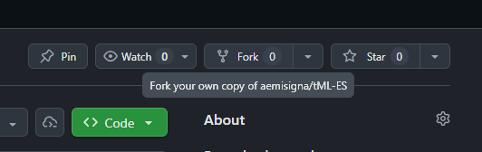
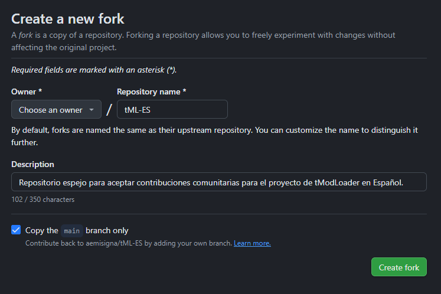
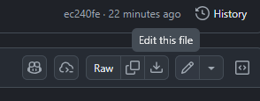
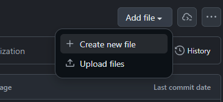
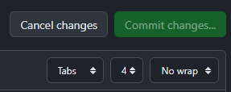
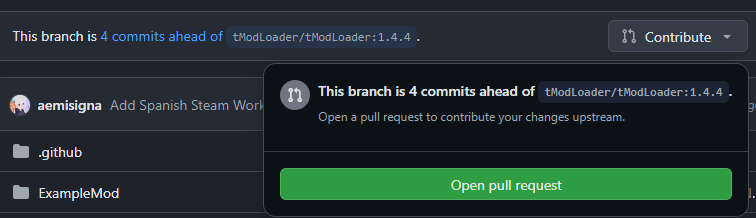
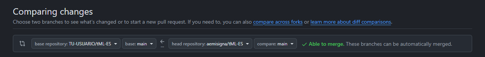
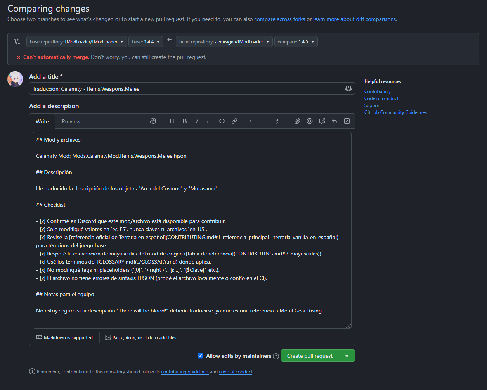

# Cómo hacer fork y abrir tu primera Pull Request

Esta guía es para quien nunca usó GitHub o nunca hizo un fork. Si ya manejas Git con soltura, puedes saltar directo a la sección [Flujo de trabajo](CONTRIBUTING.md#flujo-de-trabajo) de `CONTRIBUTING.md`.

No hace falta instalar nada para seguir esta guía — todo se puede hacer desde el navegador.

---

## 1. ¿Qué es un fork?

Un **fork** es tu propia copia del repositorio, asociada a tu cuenta de GitHub. Puedes editar lo que quieras ahí sin afectar el repositorio original — nada se rompe ni se publica hasta que el equipo de tML ES revise y apruebe tu cambio a través de una **Pull Request**.

Flujo completo: **Fork → editar en tu copia → Pull Request → revisión del equipo → integración.**

---

## 2. ¿Qué es una Pull Request y qué es el CI?

Estos dos términos van a aparecer todo el tiempo en esta guía, así que vale la pena entenderlos antes de empezar.

**Pull Request (PR)** es una propuesta de cambio. Cuando terminas de editar un archivo en tu fork, abres una PR para decirle al equipo de tML ES: "quiero que estos cambios pasen a tu repositorio". No se aplica nada automáticamente — el equipo la revisa, puede pedir ajustes, y solo cuando la aprueba se integra (`merge`) al repositorio original.

**CI (Integración Continua)** es un chequeo automático que corre apenas abres o actualizas una PR. En este proyecto, el CI valida que el archivo `es-ES` tenga sintaxis HJSON correcta (comillas, llaves, comas en su lugar) y que no falten ni sobren claves respecto al `en-US`. Es una máquina, no una persona — revisa la revisión humana del equipo, no la reemplaza. Si el CI falla, verás una cruz roja en la PR; si pasa, un check verde.

---

## 3. Crear tu fork

1. Ve al repositorio: [github.com/aemisigna/tML-ES](https://github.com/aemisigna/tML-ES)
2. Si no tienes cuenta de GitHub, crea una gratis en [github.com/signup](https://github.com/signup).
3. Haz clic en el botón **Fork** (arriba a la derecha).

   

4. GitHub muestra una pantalla de confirmación. Deja las opciones por defecto y haz clic en **Create fork**.

   

5. Listo — ahora tienes tu propia copia en `github.com/TU-USUARIO/tML-ES`.

---

## 4. Encontrar el archivo que vas a traducir

1. En tu fork, navega hasta `Localization/<Mod>/es-ES/` y busca el archivo correspondiente al `en-US` en el que vas a trabajar (revisa la [estructura de archivos](CONTRIBUTING.md#estructura-de-archivos) en `CONTRIBUTING.md` si no estás seguro de cuál es).
2. Si el archivo `es-ES` ya existe, ábrelo. Si no existe, lo crearás en el paso siguiente.

---

## 5. Editar el archivo (desde el navegador)

Para cambios puntuales no hace falta clonar nada — GitHub tiene un editor integrado.

1. Abre el archivo y haz clic en el ícono de **lápiz** (Edit this file).

   

2. Haz tus cambios siguiendo las [directrices de traducción](CONTRIBUTING.md#directrices-de-traducción) y el [formato HJSON](CONTRIBUTING.md#formato-hjson) de `CONTRIBUTING.md`.

> [!WARNING]
> Edita solo los valores, nunca las claves. No modifiques los `{0}`, `<right>`, `[i:...]` ni otros marcadores — revisa la sección [Tags y placeholders](CONTRIBUTING.md#tags-y-placeholders--no-se-traducen).

3. Si el archivo `es-ES` no existe todavía, créalo desde la carpeta correspondiente con el botón **Add file → Create new file**, usando el mismo nombre que el `en-US`.

   

> [!TIP]
> Si vas a traducir varios archivos grandes o prefieres trabajar con VS Code en tu computadora, clona tu fork en lugar de usar el editor web: `git clone https://github.com/TU-USUARIO/tML-ES.git`. El resto del flujo (commit, push, PR) es el mismo, solo cambia que se realiza desde la terminal en vez del navegador.

---

## 6. Guardar el cambio (commit)

1. Baja hasta el final de la página del editor.
2. Escribe un mensaje breve que describa el cambio, por ejemplo: `Traducción: Mods.CalamityMod.Items.Weapons.Melee`.
3. Selecciona **Commit directly to the `main` branch** (es tu propio fork, no el original — no hay riesgo).

   

4. Haz clic en **Commit changes**.

---

## 7. Abrir la Pull Request

1. Después del commit, GitHub mostrará un banner: **"This branch is 1 commit ahead of aemisigna:main"** con un botón **Contribute → Open pull request**. Haz clic ahí.

   

   > Si no aparece el banner, ve a la pestaña **Pull requests** de tu fork y haz clic en **New pull request**.

2. Verifica que la comparación sea: base repository `aemisigna/tML-ES`, base `main` ← head repository `TU-USUARIO/tML-ES`, compare `main`.

   

3. Completa:
   - **Título**: mod y archivo afectado, por ejemplo `Traducción: Calamity - Items.Weapons.Melee`.
   - **Descripción**: qué archivos modificaste y cualquier duda o decisión de traducción que quieras señalar al equipo.

   

4. Haz clic en **Create pull request**.

---

## 8. Qué sucede después de abrir la PR

1. El **CI** valida la sintaxis HJSON. Si falla, aparecerá una cruz roja — revisa el registro del check para ver qué línea tiene el error.

   

> [!NOTE]
> Si es tu primera PR en este repositorio, es posible que veas **"Workflow awaiting approval"** en vez del check corriendo — GitHub bloquea por defecto la primera ejecución de un colaborador nuevo hasta que alguien del equipo la apruebe. No es un error tuyo; solo espera a que el equipo lo apruebe. Desde tu segunda PR en adelante corre automático.

2. Con el CI en verde, el equipo de tML ES revisa el contenido siguiendo el [proceso de revisión](CONTRIBUTING.md#proceso-de-revisión).

   

3. Si te piden cambios, los comentarios aparecerán directamente en la PR. Para responder:
   - Vuelve a tu fork, edita el mismo archivo de nuevo (paso 5) y haz commit.
   - Ese nuevo commit se agrega automáticamente a la misma Pull Request — no es necesario abrir una nueva.

   

4. Cuando todo esté aprobado, el equipo integrará (`merge`) tu PR con los cambios al repositorio principal en producción (Workshop).

   

---

## 9. Mantener tu fork actualizado (para tu próxima contribución)

Con el tiempo, el repositorio original avanza con cambios de otros contribuidores. Antes de empezar una traducción nueva, actualiza tu fork para evitar conflictos:

1. En tu fork, ve a la pestaña principal del código.
2. Si tu fork está atrasado, verás: **"This branch is X commits behind aemisigna:main"** con un botón **Sync fork**.

   

3. Haz clic en **Sync fork → Update branch**.

---

## Resumen rápido

```
1. Fork (una sola vez)
2. Editar archivo es-ES en tu fork
3. Commit
4. Open pull request hacia aemisigna/tML-ES (main)
5. Esperar CI + revisión del equipo
6. Si piden cambios → nuevo commit en el mismo archivo
7. Antes de tu próxima contribución → Sync fork
```

¿Dudas en cualquier paso? Pregunta en el **[Discord del proyecto](https://discord.gg/Z43xMxKdXZ)**.
